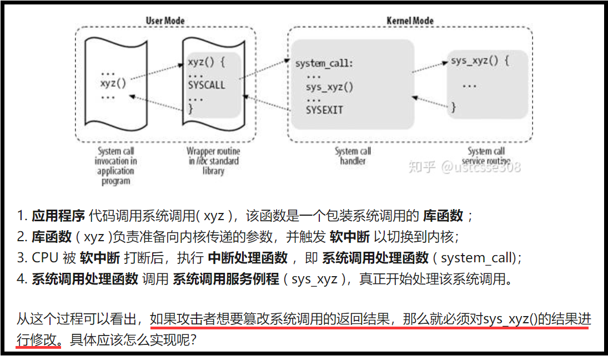
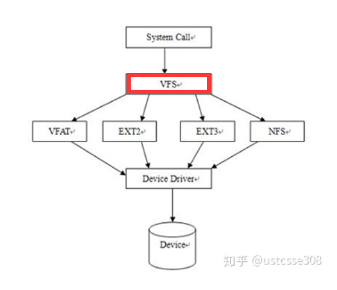

# 信息安全复习

## 一、ARP协议问题

Dos攻击：netwox 80 使用ARP攻击，阻止局域网内系统正常联网

ARP：IP-->MAC

　　主机广播IP来寻找MAC，返回是单播；

　　然后（所有主机都）缓存IP--MAC的对应关系到ARP表，

　　但ARP表不是一成不变的，因为IP--MAC对应关系不断改变。（比如：虚拟机中的IP地址，多启动几回可能就换掉了）

局域网（以太网）帧格式：


**帧类型** **Frame types**:  0800 IP   **0806 ARP**   8035 RARP

了解以太网帧的格式之后，就可以根据帧的结构发包；也可以借助netwox 80发ARP包，导致同在一个局域网的另一个主机不能联网。

### 1. ARP协议的作用是什么?

ARP执行32位 **ip地址** 到48位 **mac地址** 之间的转换


### 2. 引入ARP缓存的功能是什么？

arp -a

缓存mac地址和IP地址之间的关系，防止每次发送ip数据包之前都要进行一次ARP解析。

### 3. ARP缓存中毒的攻击方法和效果是什么？

因为ARP缓存是无状态的，只要接收到ARP包都会更新缓存

**攻击方法**：对被攻击主机发送假的ARP应答包，让被攻击者ARP缓存中IP地址映射到错误的mac地址

**效果**：就是使被攻击者无法上网。


## 二、 IP协议安全问题

以太网帧：frame_head+frame_data（ip数据报：iphead+ipdata）

ip头部：


### 1.为什么进行IP分片

硬件环境的MTU限制

虽然单个**IP报文**的**最大长度65535字节**（2<sup>16</sup>-1，IP总长度字段16位）,但是网络硬件限制了帧的大小（以太网最长**1500字节**）

### 2. IP分片如何进行重组

* 标识（**IDENT**，用于标识IP报文段的唯一标识符，具有同一IDNENT的片段属于同一个IP报文。）
* 标志（**FLAGS**，第一位保留不使用；第二位DF, DF=1时不分片；第三位MF，DF=0的情况下，除了最后一个分段的IP包的包头，其他分段的MF位都设为1。）
* 片偏移（**FO**：FRAGMENT OFFSET，指明当前片段在原始完整的IP报文中的位置（偏移）。该偏移的单位是8个字节。）

### 3. 泪滴攻击（TearDrop）的原理是什么？

构造两个分片，满足以下两个条件：

（1）第二个分片完全包含在第一个分片中。（第一个分片的FO+len > 第二个分片的FO+len）

（2）发生重叠时，第一个分片会覆盖重叠部分

```c
if (prev != NULL && offset < prev->end)
// if there are overlapping fragments；offset是第二个分片的offset，小于前一分片的结尾，存在重叠
{
i = prev->end - offset;   //计算重叠的长度，保留前一分片的重叠部分
offset += i;/* ptr into datagram */   //移动到第二分片的非重叠内容，也即前一分片的结尾
ptr += i;/* ptr into fragment data */ // 指针移动到前一分片的结尾，然后拷贝第二分片的剩余内容
//advance to the end of the previous fragment
fp->len = end - offset;  // 计算接下来需要拷贝多少字节
...
}
```

但是这样会有一个问题，当第二个分片被完全覆盖时，fp->len = end - offset 就会是一个负数，又因为 fp->len是无符号数，且在计算机中以补码的形式存储，所以会形成一个很大的数，造成**内存占用过大**，**篡改内核内存**导致系统崩溃。


**（ 解决方法：**加上一个 **if** **判断语句**，来保证 end-pre_end>0，或者加强内核内存保护 ）

### 4. 包过滤防火墙，通过过滤SYN包，防止外部链接。攻击者可以如何绕过这个过滤？

* **微小碎片攻击：**

  使第一个分片不包含SYN字段仅包含八个字节的数据（最小片段大小）。在TCP的情况下，这足以包含源和目标端口号，但它将强制TCP标志字段进入第二个片段。

  第二个分片包含TCP的SYN = 1字段。这两个分片都能通过包过滤防火墙，但是之后可以再上层重组SYN包。

* **重叠碎片攻击：**

  如果系统采用的重叠方式后一片覆盖前一片的情况下，可以使用碎片重叠攻击，使得第一个分片的SYN字段不为1，第二个分片的FO!=0并包含TCP的SYN=1字段。这样两个分片也都能通过防火墙，然后在上层重组，第二个分片覆盖第一个分片后就能重新组成SYN包。

* **微小的重叠片段攻击**

  集合前两个的优点
  
  发送三个片段
  
  * 一个完全合法的片段1(片段偏移 = 0；长度> = 16）
  * 一个只有八个字节的片段2 (片段偏移 = 0；长度= 8），本身是合法的，但是和片段1组合后会不合法
  * 不包含标头的剩余的完整消息的片段3(片段偏移 > = 2；长度=消息的其余部分）
  
  

**【详细版——分片攻击】**

**防火墙通过数据包包头信息，进行拦截**（包过滤器防火墙）

RFC：互联网国际标准机构 Request For Comment

**原有协议：有些端口阻止 外部访问请求，但是接受 对本机请求的回复（本机先发出请求）**

**漏洞是：只检查FO=0（第一个）数据片。**

**只要第一个混过去**（包装成无害的样子）**，后面**(具有同样IDentifier标识符的)**分片可以跟着全部通过防火墙**

**（1）微小碎片攻击**

**攻击方法**

**强迫TCP头部进入第二个分片，从而躲过防火墙过滤器的匹配(SYN)**

通过许多IP实现，可以在发出数据包上形成异常小的片段大小。如果片段大小足够小以迫使某些TCP数据包的TCP头字段进入第二个片段，则指定这些字段的模式的过滤规则将不匹配。如果过滤实现没有强制执行最小片段大小，则可能会通过不允许的数据包，因为它在过滤器中没有得到匹配。


**防止措施**

- **直接法：**FO=0的包长度<min，丢之
- **间接法：**若存在FO=1的分片，丢之 （ps：FO=2以上就可以了）

 

**（2） 重叠碎片攻击**

**攻击方法**

**用第二个分片（有害），覆盖第一个无害分片（用于顶包接受检查）。**    

例如：第一个分片 SYN = 0，ACK = 1（应答）

第二个分片 SYN = 1，ACK = 0 （请求连接）

这样在重组之后就是有害的报文。

**防止措施**

丢掉FO==1，且protocal==TCP 的包（此方法不彻底够用）

**(3)微小的重叠片段攻击**

片段1：攻击者（1234） - >目标（SMTP）Ack = 0

这是一个新的SMTP连接，规则1允许。

片段2：攻击者（1234） - >目标（Telnet = 23）Ack = 不存在

所有存在的字段都符合规则2，因为它可能是已有的一个FTP数据包。

根据目标机器IP堆栈中片段重组的具体实现，片段B可能会覆盖片段A以产生： 

攻击者（1234） - >目标（Telnet）Ack = 0（新的telnet连接）

**防止措施**

```c
如果FO == 0且PROTOCOL == TCP，则TRANSPORTLEN <tmin

DROP PACKET

如果FO == 1，且PROTOCOL == TCP，则

DROP PACKET
```


## 三、ICMP协议安全

ICMP（Internet control message protocol）：互联网消息控制协议

当报文本身是ICMP差错报文时不会产生ICMP差错报文，ICMP查询报文可能产生ICMP差错报文

**ICMP报文格式：**


### 1. 什么是SMURF攻击？如何防止？


**Smurf攻击是一种DDOS攻击**

冒充受害者IP地址，广播大量ICMP的**ECHO request**报文到有大量主机的网络中。默认情况下，网络中的大多数设备都会通过向源IP地址发送**ECHO REPLY**报文做出响应。如果网络上接收和响应的主机数量非常大，受害者主机就会忙于受理**ping回复包**，会使受害者主机变慢无法继续工作。

*（DDOS==分布式拒绝服务；DOS==拒绝服务；ICMP==互联网控制消息协议）*

**如何防止？**

* 配置各个主机和路由器，**不响应**ICMP请求或广播
* 配置路由器**不转发**定向到广播地址的数据包

### ✨2. 什么是ICMP重定向攻击？如何防止？**【考试重点，应该会展开考实验细节】**

A：攻击者

B：受害者

C：受访问的网络

首先，当B要访问C网络的时候，会向当前网关发送访问请求。A通过pcap网络嗅探等工具捕获这一请求，然后冒充B的网关向B发送ICMP重定向报文，将网关地址重定向为虚假地址。当B接收到A发送的重定向报文的时候就会修改自己的路由表，将访问C网络的网关地址改为重定向地址。这样B上网会发生部分失败（因为路由器和A都会给B发送路由信息，这样B的路由表一会对一会错）。

防止手段：**过滤掉ICMP重定向报文**

实验流程：

1. pacp抓包得到受害者IP
2. 使用raw socket手动修改ip、icmp里面的内容
3. 开始发包，攻击受害者

## 四、TCP协议安全问题

### 1. 什么是SYN flooding攻击？效果是什么？如何防止


A：攻击者

B：被攻击服务器

C：其他访问者

首先，B开放一个端口，进行侦听。A构造大量的TCP的SYN包发给B。

B接收到SYN包就需要为即将建立的TCP链接分配TCB（Transmission Control Block），并且进入半连接状态。由于B最多可以开启的半连接个数是一定的，收到内存的限制，当半连接数目过多**消耗掉大部分可用内存**，就会使正常的链接请求都得不到处理。此时C对B进行访问，建立TCB链接的请求就不能被正常处理。

**效果**：Dos攻击--占用资源（内存、CPU、带宽），拒绝服务。*（SYN flooding可以以小博大）*

**防止手段**：

* **SYN Cookie**：在第三次握手ACK到达之前不分配任何资源。

SYN Cookie关键在于：如何在不分配资源的情况下，能识别是否是一个完整的TCP三次握手。SYN cookie精心构建初始序列号：**t** (5bit), **m** (3bit), **s**(hash(s.ip, c.ip, port, t))来验证。

**问题**是可以通过穷举t和m，然后伪造s来破解

* **SYN Cache**：

四元组<源IP，源端口，目的IP，目的端口>，可以在接收到SYN包时，仅仅分配有限的空间，来维持其后可能需要的信息，而不是分配整个的TCP控制块。到三次握手的第三步才分配。

### 2. 端口扫描的原理是什么？

nmap的工作原理：首先尝试与一个个的端口链接：

* 没有任何回复的是被过滤了filtered
* 收到SYN+ACK就是开着的：open
* 收到RTS就是关闭的：close


### 3. nmap -sS和nmap -sT的区别是什么？

**sS发送：SYN包，无法连接发送RST包**  *（不建立连接、无痕迹；但需要root权限 =》<font color = red>最常用</font>）*

nmap -sS：向目标主机发送TCP的SYN包，当目标主机返回SYN/ACK包的时候，直接发送RST包。不与目标主机建立完整的TCP连接。可以不留下扫描痕迹，但需要特殊权限。

**sT：连接后发RST包 ** **(建立连接、不隐蔽 =》*不推荐使用*  ) **

nmap -sT：与目标主机**建立完整的TCP连接后**，

再向目标主机发送RST包。不需要特殊权限，但是会留下扫描痕迹。

### 4. nmap -sA的扫描原理是什么？

**sA：发ACK包**

ACK数据包不会启动会话建立，所以**比较隐蔽**；同时，因为ACK数据包不会单独出现。

所以，对于端口，不管是开放的还是关闭的，收到一个**不请自来的ACK包都会发一个RTS包**（只能**判断是否被过滤**）

### 5. nmap idle扫描的原理

A：攻击者

B：Zombie主机

C：目标主机

首先A先向B发送SYN/ACK包，然后B返回一个RST包，并记录该包的**IPID**。

然后A冒充B向C发送SYN包**。如果C的端口开放，则返回一个SYN/ACK包，B收到之后会返回一个RST包，并且IPID+1。**否则（C端口不开放或被过滤）C返回一个RST包。

之后A再向B发送一个SYN/ACK包，查看B返回的**IPID**值，如果IPID的值增加了2，则可知C的端口开放。

但是idle无法区分端口是被过滤还是关闭。

<hr></hr>

**知识点：**

- **如果没有发送SYN情况下，收到SYN|ACK包（不请自来），那么会回复RST。**
- **一个不请自来的RST，会被忽略。**

- 每个IP包都有Identifier**（IPID）**，用于标识属于同一数据包的所有IP碎片
- 每发一个数据包，大部分操作系统简单地进行：Identifier+1
- 因此，从Identifier可以知道，主机在上一次发包后又发了几个数据包

利用网络里空闲的Zombie僵尸主机：


攻击者idle扫描：

通过IPID的值判断，目标主机端口状态：

- **如果IPID+1: 关闭 or 过滤**   +1 就是A又去探测了一次 所以加了1
- **如果IPID+2: 开**       +2是除了A探测，又加了一个B回复C的RST


## 五、防火墙

### 1. iptables是状态防火墙。状态防火墙相比于包过滤防火墙的优点是什么？

* 包过滤防火墙（packet filter）是无状态、静态的。易于设置、处理速度快；

缺点：无法分析上下文，难以处理分片【IP碎片攻击】，不支持某些复杂协议，不能防止应用层等恶意攻击。

* 状态防火墙。优点是建立了连接状态表，结合上下文状态进行过滤，可以实现较好的过滤效果。

在同一个会话中，五元组不会发生变化；但是各种状态（SYN、SYN+ACK以及ACK）、分片（FO）等都是可以变化的

### 2. NAT的作用是什么

NAT：网络地址转换。

一种把内部私有地址转换为公有地址的的技术。在一定程度上能够有效的解决公网IP地址不足的问题。

* 内网主机向外发出数据包的时候，NAT服务负责将数据包的源地址IP转换为公网IP地址（SNAT）；S->Source发包时：转换源地址

* 当外网对内网主机回复到达时，NAT服务负责将回复包的目的IP地址改为内网IP地址（DNAT）；D->Destination收包时：转换目的地址

### 3. sudo iptables -P INPUT DROP;  iptables -A INPUT -p tcp --spot 80 -j ACCEPT;这两句的作用是什么？

* 第一句，将iptables的策略定为：丢弃（drop）所有传入（input）的数据包。


* 第二句，添加INPUT策略，允许**tcp源端口号为80（http包）**的数据包通过防火墙。

## 六、Rootkit
### 1.什么是rootkit？
黑客安装后门backdoor，获取长期root权限后，便于之后回访，安装rootkit，隐藏踪迹，收集信息，便于长期回访以及获得对其他系统的访问权限。
rootkit一般和后门backdoor配合着使用，一前一后
*短暂的root权限+backdoor+rootkit ==> 长期的root权限*

### 2. LKM的好处是什么？
LKM（**可加载内核模块**：Loadable Kernel Module）
优点是动态加载：内核进行修改和扩展时，不需要重新编译内核和重启系统。
（LKM包含entry和exit函数，分别用于插入和删除）
### 3.请描述系统调用劫持的过程。
首先，当进行一次系统调用的时候，会触发软中断（INT $0x80）==> 进入内核的系统调用处理程序。  
然后在系统调用处理程序的代码中寻找到sys_call_table地址。
接下来，根据**系统调用表sys_call_table的地址**和**eax中存放的系统调用号**，找到真正的<font color = red>系统调用例程的地址</font>，  
将其**替换成攻击者**的系统调用处理函数地址。

### 4. 请解释，为何unix可以做到一切皆文件？
**虚拟文件系统（VFS）**  
* 向上，对**应用层的**（system call）提供了一个标准的文件操作接口（如write/read）;
* 对下，对**文件系统**提供了一个标准接口，以便其他操作系统的文件系统可以方便的移植到Linux上；  
VFS内部则通过一系列高效的管理机制，比如inode cache，dentry cache以及文件系统的预读等技术，使得底层文件系统不需沉溺到复杂的内核操作，即获得高性能；此外VFS把一些复杂的操作尽量抽象到VFS内部，使得底层文件系统实现更简单。
  

Linux中，一切皆文件。现在一般使用 Ext4 文件系统。  
FAT（File Allocation Table文件分配表）：FAT占用内存过多，难以管理较大的硬盘存储。
## 七、缓冲区溢出
缓冲区：分配一段有限大小的内存空间
缓冲区溢出：从缓冲区 读/写 的数据超出了缓冲区可以容纳的范围。


